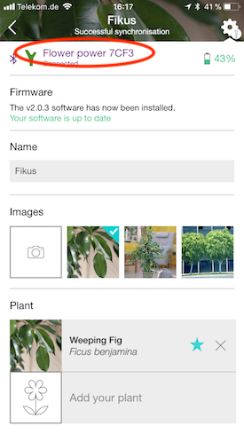
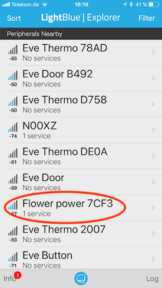

# Add your Flower Power device

Once you've installed the plugin you can add your Flower Power plant sensors to HomeKit.

## Sensor configuration

Each sensor is configured using the following structure:

```json
{
  "name": "Plant name as seen in HomeKit",
  "id": "FlowerPower Device Name"
}
```

The sensors are located using their advertised local name. The local name can either be seen
in the Parrot Flower Power app:



Or you can use an app (in this case [LightBlue Explorer](https://itunes.apple.com/us/app/lightblue-explorer/id557428110?mt=8) by [PunchThrough](https://punchthrough.com)) on your iOS device to locate the name of the Flower Power device.



## Example configuration using the above screen shots

```json
{
  "name": "My plant",
  "id": "Flower power 7CF3"
}
```

Once you've added your sensor to your config.json, it should look similar to the following:

```json
{
  "bridge": {
    "name": "Homebridge",
    "username": "xx:xx:xx:xx:xx:xx",
    "port": 52118,
    "pin": "135-79-864"
  },
  "platforms": [
    {
      "platform": "FlowerSensors",
      "sensors": [
        {
          "name": "Plant/Sensor name",
          "id": "Flower power 7CF3"
        }
      ]
    }
  ]
}
```

## Start homebridge

Now you're ready to start homebridge to monitor your Flower Power sensors, create
rules to monitor them and to integrate them into your home.

## Multiple sensors

Multiple sensors are supported, simply add each of them to the sensors section:

```json
{
  "bridge": {
    "name": "Homebridge",
    "username": "xx:xx:xx:xx:xx:xx",
    "port": 52118,
    "pin": "135-79-864"
  },
  "platforms": [
    {
      "platform": "FlowerSensors",
      "sensors": [
        {
          "name": "Plant/Sensor name",
          "id": "Flower power 7CF3"
        },
        {
          "name": "Plant/Sensor name 2",
          "id": "Flower power 3AD8"
        }
      ]
    }
  ]
}
```

## Configuring recommendations

This plugin is able to create sensors that trigger if the light or humidity levels
are below recommended values for your plant. To enable recommendations, extend the
plant configuration with the following values:

```json
{
  "name": "Plant/Sensor name",
  "id": "Flower power 7CF3",
  "recommendations": true,
  "thresholdLightLevel": 1200,
  "thresholdHumidity": 26
}
```

The added three values are described below:

| Value | Type | Description |
|-------|------|-------------|
| recommendations | Boolean | Determines if recommendations and the corresponding sensors are enabled. If true, the plugin monitors the sensor data and triggers contact sensors if the thresholds are not reached. |
| thresholdLightLevel | float | The light level threshold in lux (lumens per square meter.) The plugin averages all non-zero light levels over the span of 24h to determine if the threshold was met. |
| thresholdHumidity | float | The humidity threshold in percent. The humidity levels are averaged over a span of 24h before compared with the threshold. |
